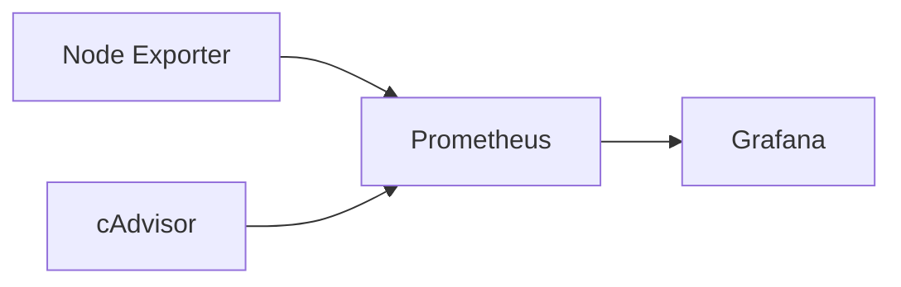

# Observability Platform

## Objective

Build an observability platform for the homelab.

## Components

- Prometheus: metrics collection
- Grafana: dashboards and visualization
- Node Exporter: host metrics
- cAdvisor: container metrics

## Target Routes

```text
grafana.home.arpa     -> Grafana
prometheus.home.arpa  -> Prometheus
```

## Architecture


## Implementation

Node Exporter and Prometheus have been deployed.

### Node Exporter

Node Exporter exposes host-level metrics from the Raspberry Pi, including CPU, memory, disk, filesystem and network metrics.

### Prometheus

Prometheus collects metrics from configured targets at regular intervals.

In this setup, Prometheus scrapes Node Exporter every 15 seconds.

### Route

```text
prometheus.home.arpa → Traefik → Prometheus
````

## Configration

```text
infrastructure/docker/prometheus/config/prometheus.yml
```

## Persistent Data 

```text
/srv/storage/docker/volumes/prometheus
```
