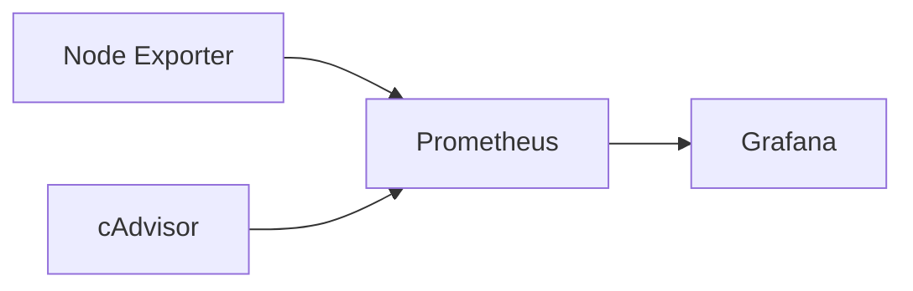

# Observability Platform

## Objective

Build an observability platform for the homelab.

## Components

- Prometheus: metrics collection
- Grafana: dashboards and visualization
- Node Exporter: host metrics
- cAdvisor: container metrics

## Target Routes

```text
grafana.home.arpa     -> Grafana
prometheus.home.arpa  -> Prometheus
```

## Architecture

